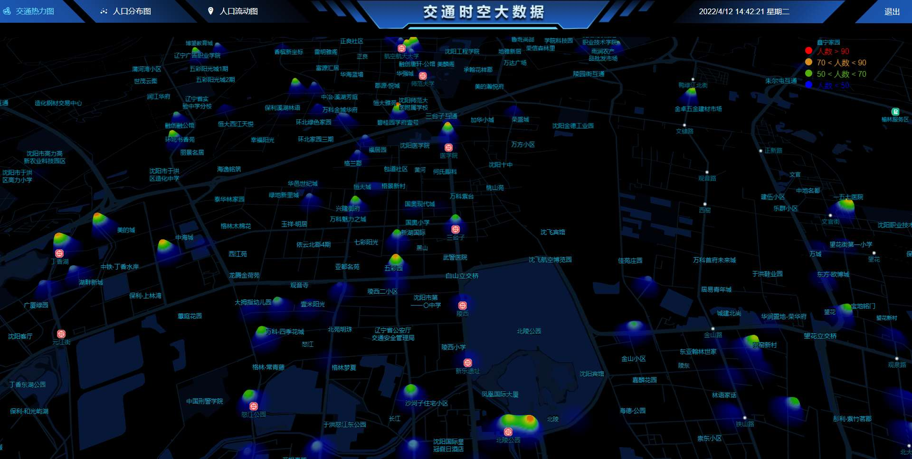
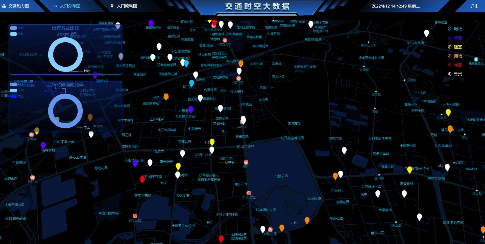
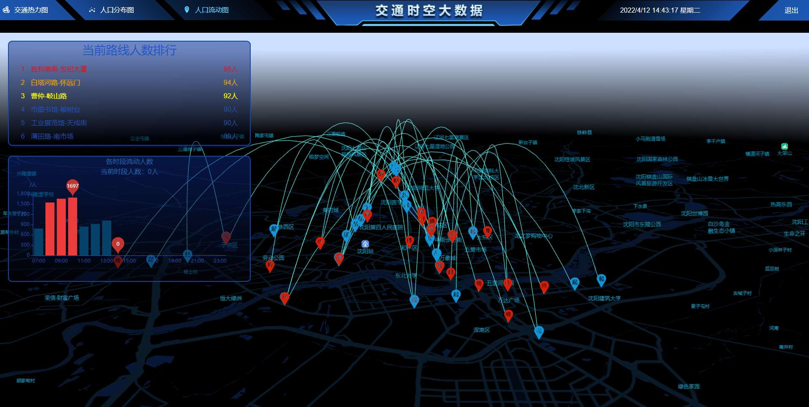

## 交通时空大数据

#### 项目描述

项目核心是百度地图 ```AMap``` 和 ```echarts```，用百度地图提供的 ```API ```搭建的地图，项目中用到的有热力图、散点图和连线图，图表类型是由 ```echarts```提供的图表进行展示，包括饼图、柱状图；


#### 安装依赖

``` javascript
npm install
```


#### 启动服务

``` javascript
npm run serve
```


#### 项目界面

##### 1、登录页面


##### 2、热力图




##### 3、散点图




##### 4、连接图

